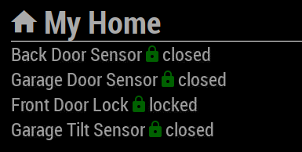
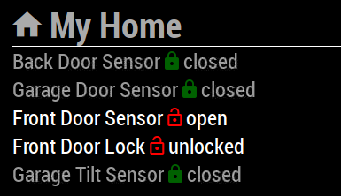

# MMM-IOTStatus
A [MagicMirror](https://github.com/MichMich/MagicMirror)'s Module to show my [Smartthings](https://www.smartthings.com/) Home Automation device status using [Firebase Realtime Database](https://firebase.google.com/docs/database)

The project uses a thingLayer, a Smartthings SmartApp to report the device status to Firebase. This module listens to the Firebase events in realtime and renders the device status on your mirror.

[](https://circleci.com/gh/aduyng/MMM-IOTStatus/tree/master)

## Screenshots




## Installation
### 1. Setup the MagicMirror module
```bash
cd ~/MagicMirror/modules
git clone https://github.com/aduyng/MMM-IOTStatus.git
cd MMM-IOTStatus
npm install --production
```
### 2. Setup Firebase Realtime Database
You will need a realtime database for Smartthings to push the device status to. Follow this tutorial, https://firebase.google.com/docs/web/setup, to setup a Firebase project and a realtime database.

Take note of the project configuration especially the realtime database URL.

### 3. Setup Smartthings
I modified the original of [thingLayer](https://github.com/jodyalbritton/smartthings/blob/master/thingLayer.groovy) SmartApp developed [Jody Albritton](https://github.com/jodyalbritton) to report my device status to Firebase. 

1. Install the modified version of thingLayer SmartApp ([./smartthings/thingLayer.groovy](./smartthings/thingLayer.groovy)) via Smartthings IDE
1. Switch to App Settings, enter the realtime database URL on step 2. above to the value of `firebaseUrl`. 

thingLayer will keep pushing changes to the path `/iot` of your realtime database above. 

## Configuration
```javascript
  {
			module: "MMM-IOTStatus",
			position: "top_right",
			config: {
				title: 'My Home', // the title appears on the top
				firebaseDatabaseRootRef: '/iot', // the path of the realtime database to listen to
				firebaseConfig : {
					apiKey: "<the api key>",
					databaseURL: "<the realtime database URL>",
					projectId: "<the project id>",
					appId: "<the appId - optional>"
				}
			}
  }
```
